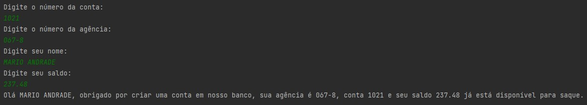

## Desafio

Vamos exercitar todo o conteúdo apresentado no módulo de Sintaxe codificando o seguinte cenário.

1. Crie o projeto `ContaBanco` que receberá dados via terminal contendo as características de conta em banco conforme atributos abaixo:
2. Dentro do projeto, crie a classe `ContaTerminal.java` para realizar toda a codificação do nosso programa.

###### Revise sobre regras de declaração de variáveis

| Atributo  | Tipo     | Exemplo   
| --------- | ---------| ------- 
| Numero    | Inteiro  | 1021 
| Agencia   | Texto    | 067-8
| Nome Cliente | Texto    | MARIO ANDRADE
| Saldo | Decimal |237.48

###### Revise sobre terminal, main args e a classe Scanner
2. Permita que os dados sejam inseridos via terminal sendo que o usuário receberá a mensagem de qual informação será solicitada, exemplo:

* Programa: "Por favor, digite o número da Agência !"
* Usuário: 1021 *(depois ENTER para o próximo campo)*

###### Revise sobre concatenação e classe String com método concat

3. Depois de todas as informações terem sido inseridas, o sistema deverá exibir a seguinte mensagem:

*"Olá [Nome Cliente], obrigado por criar uma conta em nosso banco, sua agência é [Agencia], conta [Numero] e seu saldo [Saldo] já está disponível para saque".*

Os campos em [ ] devem ser alterados pelas informações que forem inseridas pelos usuários.

## Minha Solução

Para resolver o desafio proposto, criei o projeto `ContaBanco` e implementei a funcionalidade de inserção de dados via terminal na classe `ContaTerminal.java`. Aqui está uma visão geral da minha abordagem:

1. **Classe Conta:**
    - Criei uma classe `Conta` com os atributos especificados: `numero`, `agencia`, `nomeCliente` e `saldo`.
    - Implementei um método `toString()` na classe `Conta` para facilitar a exibição dos dados da conta.

2. **Inserção de Dados via Terminal:**
    - Utilizei a classe `Scanner` para receber os dados do usuário via terminal.
    - Cada atributo da conta foi solicitado individualmente ao usuário, com uma mensagem indicando qual informação estava sendo solicitada.
    - Após a inserção de todos os dados, uma mensagem de agradecimento com os detalhes da conta foi exibida ao usuário.

3. **Captura de Tela:**
    - Como evidência da execução bem-sucedida do programa, incluí uma captura de tela (`chamada_de_terminal.jpg`) demonstrando o programa em funcionamento.

Com essa abordagem, o programa permite ao usuário inserir os dados da conta bancária de forma interativa e exibe uma mensagem personalizada de agradecimento com os detalhes da conta.

